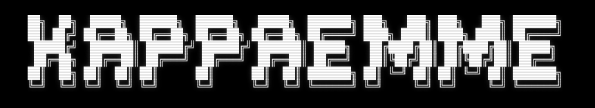

  

<h1 align="center">Hi, I'm Francesco 👋</h1>

  <strong>Building AI-powered software and open-source tools.</strong>
   
  Building in public.

---

# 🚀 Current Project

## Microdex

**The open-source companion for Codex.**

Interact with your local Codex runtime from anywhere.

⭐ If you find it useful, consider leaving a star.

👉 https://github.com/Kappaemme-git/microdex

---

# 🌐 Portfolio

Explore everything I'm building, from open-source tools to AI projects.

**→ https://kappaemme.dev**

---

# 🛠️ Tech Stack

  

---

# ❤️ Support My Work

If one of my projects helped you, consider sponsoring my open-source work.

👉 https://github.com/sponsors/Kappaemme-git

---

# 🤝 Connect

🌍 Website  
https://kappaemme.dev

𝕏 X (Twitter)  
https://x.com/Kappaemme1926

💻 GitHub  
https://github.com/Kappaemme-git

---

### Building products developers actually use.

One project at a time.

